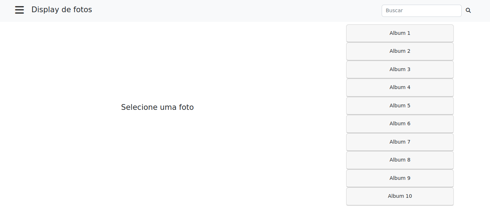
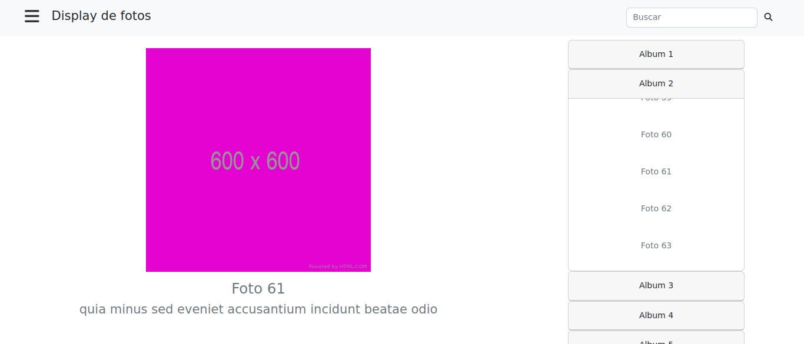

# Display de fotos

Este projeto apresenta uma página para a exibição de fotos. 

Foi desenvolvida uma aplicação React integrada com a biblioteca Redux. Esta é uma adaptação do projeto desenvolvido numa [aula sobre Redux](https://www.youtube.com/watch?v=dzhDkXiqSmM).

##  :gear: Tecnologias

- HTML
- CSS
- JavaScript
- React
- Redux
- React Hooks
- Bootstrap

##  :art: Layout

